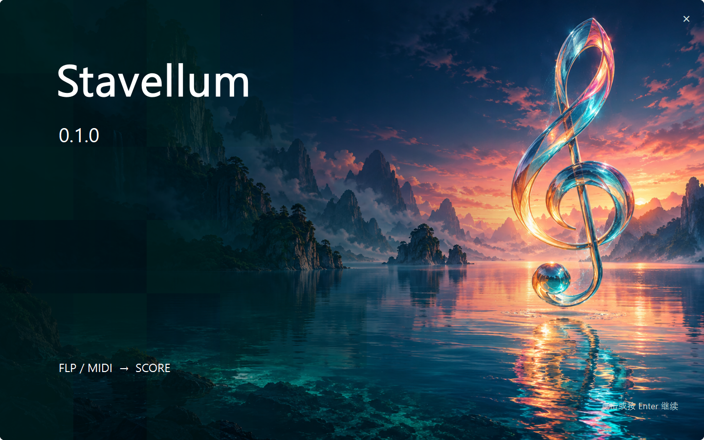
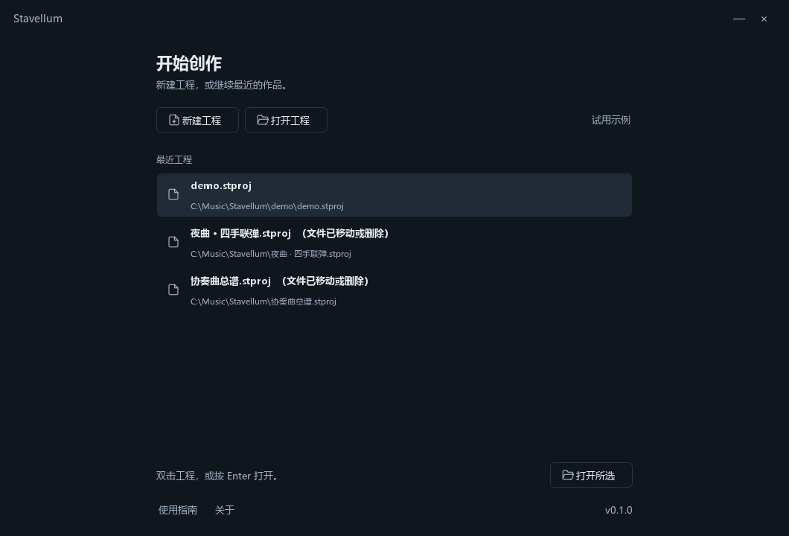
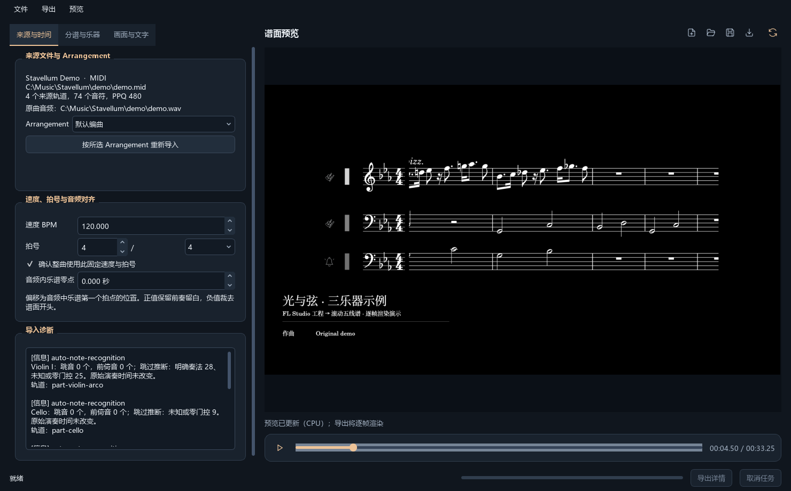

# feat(ui): 精简桌面界面并完善启动与 PR 工作流

## 问题与结果

桌面界面的样式不一致，常用操作分散在菜单中，欢迎页的品牌与装饰占用了较多空间。
现在编辑器、新建向导和工程列表共享深色主题；编辑器的主要操作收为小图标按钮，
工程列表保留紧凑操作和最近工程，选中行仅使用淡色背景。
进入工程列表前显示独立的音乐主题启动封面，准备好后约 1.4 秒自动继续，支持点击、
Enter / Space 跳过及关闭取消。

重新导入、键盘移动时间轴和后台结果应用失败时的状态问题也已修复。
贡献规范、PR 模板和 Windows CI 为这些行为提供统一的验证与审查要求。

依赖 [基础 PR #1](https://github.com/CavanasD/stavellum/pull/1)，当前目标为 `feat/rust-vulkan-migration`。
基础 PR 合并后，将本 PR 目标改为 `main` 并重新核对差异。

## 变更范围

- 共享桌面主题和随包发布的 SVG；新建、打开、保存、MP4 导出、更新预览及播放使用紧凑图标，保留提示、无障碍名称与菜单快捷键。
- 简化工程起始页，取消大 Logo、装饰卡片与选中项左侧亮条；长名称和路径分别省略，最近工程可滚动并支持键盘打开。
- 新启动封面使用独立背景和 Qt 绘制的文字/方格，适应小屏幕；指定工程在封面结束后打开，提前关闭不会继续初始化。
- 重新导入后保留保存路径，Ctrl+S 写回原文件；键盘移动时间轴更新预览，内部进度刷新不会递归渲染；结果应用失败后恢复操作并显示失败状态。
- 增加贡献说明、PR 模板、规范标题检查和 Windows Python/Rust CI；补充实际界面截图脚本及审查记录。

工程格式、依赖、CLI 参数、原生 ABI 和谱面/视频帧绘制保持兼容。Rust 迁移与格式化位于基础 PR。
背景由内置 imagegen 生成，来源和最终提示词见 [STARTUP_ART.md](STARTUP_ART.md)。

## 提交拆分

1. PR 贡献规范与 CI。
2. 重新导入的保存路径修复及回归测试。
3. 键盘时间轴修复及回归测试。
4. 后台结果失败状态修复及回归测试。
5. 统一主题、紧凑编辑器按钮及向导样式。
6. 简约工程起始页和最近工程列表。
7. 可跳过的启动封面及启动流程测试。
8. 截图工具、公开截图、Review 记录和 PR 说明。

## 验证

Windows x64、Python 3.14、PySide6 6.11.2，使用与当前 Rust 源码对应的本机 DLL。

| 检查 | 结果 |
| --- | --- |
| `uv run ruff check src tests scripts` | 通过 |
| GUI、欢迎页、向导、启动流程、品牌及启动封面测试 | 144 通过，1 跳过，50.63 秒；离屏平台跳过原生窗口堆叠 |
| 原生 Windows 启动封面与向导所有权/层叠测试 | 9 通过，2.06 秒，覆盖上述跳过项 |
| Rust fmt / workspace test / clippy | 通过；8 项单元测试及文档测试通过，使用仓库构建助手加载 MSVC 环境 |
| `uv build --wheel` | 通过；确认主题、启动模块/PNG、10 个 SVG 和两份 Rust DLL 均在包内 |
| PR 标题格式检查、`git diff --check` | 通过 |

完整命令、修复依据和验证范围见 [UI_PR_REVIEW.md](UI_PR_REVIEW.md)。
新启动封面之前的完整套件结果属于阶段记录，未作为最终提交的完整测试结果填入上表。

## UI 证据

实际 Qt 界面截图；工程和来源路径仅替换为公开示例路径。
欢迎页 1060×720、编辑器 1480×920，离屏缩放 100%；启动封面原生逻辑尺寸 960×600、系统缩放 150%。
另检查了 900×620 / 1000×700 的较小窗口，以及 150% 离屏缩放。
复现：`uv run python scripts/preview_ui.py --output artifacts/ui-preview --public-paths`。

## 限制与迁移

此草稿依赖基础 PR #1。CI 使用离屏 Qt，GPU 导出和其他设备仍需相应设备验证。
未复测外部 FLP 参考工程或完整的慢速视频导出。新工作流的远端执行结果以 PR 检查区为准；
分支保护仍需维护者配置。无需工程格式迁移。

## 提交检查

- [x] 标题符合 `type(scope): 描述`，范围与当前 diff 一致。
- [x] 已按贡献规范记录本次验证结果。
- [x] 行为修复有回归测试，文档和随包素材已同步。
- [x] 未提交临时文件、生成的 DLL、缓存、个人路径或凭据；公开截图使用示例路径。
